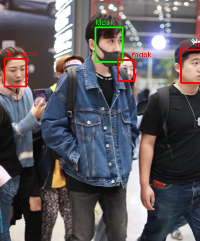

# MaskDetector-SVM
A computer vision system that detects mask usage (mask and no mask).
The system diagram is shown below

It consists of three stages:
1) Face detection: an input image is processed with the MTCNN model. It outputs the bounding box and the position of some face landmarks (eyes, nose, mouth) for each detected face.
2) Feature extraction: a color analysis of specific face regions. The idea is to compare the color of the skin in the forhead or between the eyes with respect to the area between the nose and the mouth. A 2-dim feature vector is calculated for each detected face.
3) Classifier: an SVM linear classifier with an accuracy score around 95%.

This project was published in 2021 ELECTRO congress [1] and it was inspired by Buciu's color quotient method [2].

# Datasets
A portion of three datasets were used for this project.
1) Face Mask Detection dataset (Kaggle)
2) MaskedFace-Net [2,3]
3) CelebA

The reduced datasets can be downloaded [here](https://drive.google.com/drive/folders/1-1iwVY7gzeKFAERmCEPkn-W_MK2Y4A6r?usp=sharing)

# Implementation
The whole training process is done by executing the train_svm.py file. It will create a json file for each dataset used and a joblib file with the trained classifier.
To implement the trained system you have to run the maskdetector.py file, giving it the input image path as a parameter or modifying the source code accordingly.

# Results
 

# References
[1] J. A. Navarro-Acosta, M. I. Chacón-Murguía, and J. A. Ramírez-Quintana, “ALGORITMO PARA LA DETECCIÓN DEL USO DE CUBREBOCAS EN IMÁGENES,” Congr. Int. en Ing. Electrónica. Mem. ELECTRO, vol. 43, pp. 225–230, 2021. [Online]. Available: http://electro.itchihuahua.edu.mx/revista

[2] I. Buciu, "Color quotient based mask detection," 2020 International Symposium on Electronics and Telecommunications (ISETC), 2020, pp. 1-4, doi: 10.1109/ISETC50328.2020.9301079.

[3] Adnane Cabani, Karim Hammoudi, Halim Benhabiles, and Mahmoud Melkemi, "MaskedFace-Net - A dataset of correctly/incorrectly masked face images in the context of COVID-19", Smart Health, ISSN 2352-6483, Elsevier, 2020, DOI:10.1016/j.smhl.2020.100144

[4] Karim Hammoudi, Adnane Cabani, Halim Benhabiles, and Mahmoud Melkemi,"Validating the correct wearing of protection mask by taking a selfie: design of a mobile application "CheckYourMask" to limit the spread of COVID-19", CMES-Computer Modeling in Engineering & Sciences, Vol.124, No.3, pp. 1049-1059, 2020, DOI:10.32604/cmes.2020.011663

# License
https://creativecommons.org/licenses/by-nc-sa/4.0/

